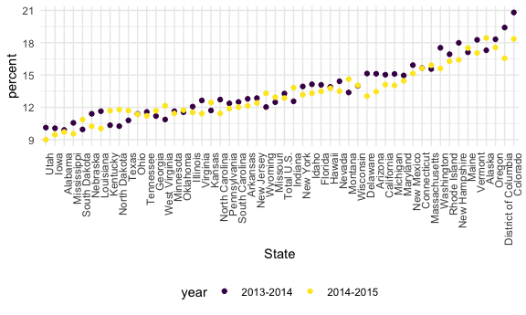
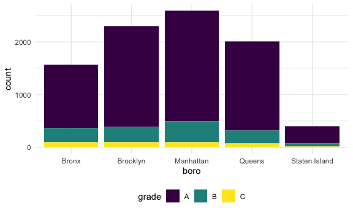
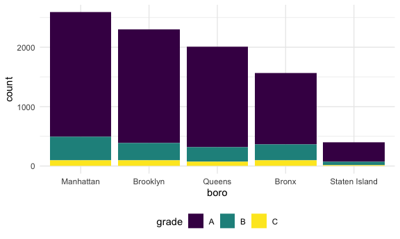
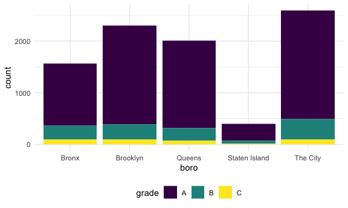

strings_and_factors
================
Fenglin Xie
2025-10-24

# strings

\##strings–可以是数字，可以是字母，反正就是一串东西 \##对于处理regular
expression很有用，sometimes we do not know the exact match but we know
the general
pattern,like我想去掉data中的字母，但其实不同数据的字母位置可能不同，或者我不知道它在哪里，这个时候就可以用string进行操作

``` r
library(tidyverse)
```

    ## ── Attaching core tidyverse packages ──────────────────────── tidyverse 2.0.0 ──
    ## ✔ dplyr     1.1.4     ✔ readr     2.1.5
    ## ✔ forcats   1.0.1     ✔ stringr   1.5.2
    ## ✔ ggplot2   4.0.0     ✔ tibble    3.3.0
    ## ✔ lubridate 1.9.4     ✔ tidyr     1.3.1
    ## ✔ purrr     1.1.0     
    ## ── Conflicts ────────────────────────────────────────── tidyverse_conflicts() ──
    ## ✖ dplyr::filter() masks stats::filter()
    ## ✖ dplyr::lag()    masks stats::lag()
    ## ℹ Use the conflicted package (<http://conflicted.r-lib.org/>) to force all conflicts to become errors

``` r
knitr::opts_chunk$set(
  fig.width = 6,
  fig.asp = .6,
  out.width = "90%"
)

theme_set(theme_minimal() + theme(legend.position = "bottom"))

options(
  ggplot2.continuous.colour = "viridis",
  ggplot2.continuous.fill = "viridis"
)

scale_colour_discrete = scale_colour_viridis_d
scale_fill_discrete = scale_fill_viridis_d
```

load key package

``` r
library(rvest)
```

    ## 
    ## Attaching package: 'rvest'

    ## The following object is masked from 'package:readr':
    ## 
    ##     guess_encoding

``` r
library(p8105.datasets)
```

## Mostly use string vectors

先拿vector做例子，不建立dataframe \##case matters-大写和小写不同

``` r
##创建一个string
string_vec = c("my", "name", "is", "Lin")

##检测某一个item(类似filter)
str_detect(string_vec, "Lin")
```

    ## [1] FALSE FALSE FALSE  TRUE

``` r
##检测所有包含这个元素的item
str_detect(string_vec, "i")
```

    ## [1] FALSE FALSE  TRUE  TRUE

``` r
##替换某一个item（类似mutate）
str_replace(string_vec,"Lin", "Fenglin")
```

    ## [1] "my"      "name"    "is"      "Fenglin"

``` r
##替换所有包含这个元素的item
str_replace(string_vec, "i", "I")
```

    ## [1] "my"   "name" "Is"   "LIn"

``` r
##remove the item
str_replace(string_vec, "i", "")
```

    ## [1] "my"   "name" "s"    "Ln"

``` r
str_remove(string_vec, "i")
```

    ## [1] "my"   "name" "s"    "Ln"

``` r
string_vec = c(
  "i think we all rule for participating",
  "i think i have been caught",
  "i think this will be quite fun actually",
  "it will be fun, i think"
  )

##检测包含i think的item
str_detect(string_vec, "i think")
```

    ## [1] TRUE TRUE TRUE TRUE

``` r
##检测以i think开头的item
str_detect(string_vec, "^i think")
```

    ## [1]  TRUE  TRUE  TRUE FALSE

``` r
##检测以i think结尾的item
str_detect(string_vec, "i think$")
```

    ## [1] FALSE FALSE FALSE  TRUE

``` r
##去掉以i think结尾的item的i think部分
str_remove(string_vec, "i think$")
```

    ## [1] "i think we all rule for participating"  
    ## [2] "i think i have been caught"             
    ## [3] "i think this will be quite fun actually"
    ## [4] "it will be fun, "

pumpkin themed example \##大小写和有无空格matters！！

``` r
string_vec = c(
  "Time for a Pumpkin Spice Latte!",
  "went to the #pumpkinpatch last weekend",
  "Pumpkin Pie is obviously the best pie",
  "SMASHING PUMPKINS -- LIVE IN CONCERT!!"
  )

str_detect(string_vec, "pumpkin")
```

    ## [1] FALSE  TRUE FALSE FALSE

``` r
##检测包含大写p和小写p的item
str_detect(string_vec, "[Pp]umpkin")
```

    ## [1]  TRUE  TRUE  TRUE FALSE

Let’s get a bit more complicated

``` r
string_vec = c(
  '7th inning stretch',
  '1st half soon to begin. Texas won the toss.',
  'she is 5 feet 4 inches tall',
  '3AM - cant sleep :('
  )

##包含1234567890这些数字的item
str_detect(string_vec, "[1234567890]")
```

    ## [1] TRUE TRUE TRUE TRUE

``` r
str_detect(string_vec, "[0-9]")
```

    ## [1] TRUE TRUE TRUE TRUE

``` r
##包含0-9这些数字并且后面紧跟着大写字母A-Z的（中间无空格）
str_detect(string_vec, "[1234567890][A-Z]")
```

    ## [1] FALSE FALSE FALSE  TRUE

``` r
##包含0-9这些数字并且后面紧跟着字母A-Z的,无论大小写（中间无空格）
str_detect(string_vec, "[1234567890][a-zA-Z]")
```

    ## [1]  TRUE  TRUE FALSE  TRUE

``` r
string_vec = c(
  'Its 7:11 in the evening',
  'want to go to 7-11?',
  'my flight is AA711',
  'NetBios: scanning ip 203.167.114.66'
  )

##检测7后面跟着某个element然后后面再跟着一个1
##`.`代表的是anything matches this，是一个特殊符号
str_detect(string_vec,"7.1" )
```

    ## [1] TRUE TRUE TRUE TRUE

``` r
##而如果真的想detect这个element`.`,则需要在前面加上\\
##Some characters are “special”. These include [ and ], ( and ), and .. If you want to search for these, you have to indicate they’re special using \. Unfortunately, \ is also special, so things get weird.
str_detect(string_vec,"7\\.1" )
```

    ## [1] FALSE FALSE FALSE  TRUE

## Factors

\##和string不同，string就是copy了所有的内容，包括引号，而factor是不包括引号的，而且会展示level（in
order：第一个代表female，第二个代表male）

``` r
vec_sex = factor(c("male", "male", "female", "female"))
vec_sex
```

    ## [1] male   male   female female
    ## Levels: female male

``` r
##把这个factor变成numeric的形式
as.numeric(vec_sex)
```

    ## [1] 2 2 1 1

``` r
## level的order默认会按照字母排序，如果想要变成按照数据本身顺序排序的话就用`fct_inorder`
vec_sex = fct_inorder(vec_sex)
vec_sex
```

    ## [1] male   male   female female
    ## Levels: male female

## Revisit NSDUH

import NSDUH data from the web

``` r
url = "https://samhda.s3-us-gov-west-1.amazonaws.com/s3fs-public/field-uploads/2k15StateFiles/NSDUHsaeShortTermCHG2015.htm"

drug_use_html = read_html(url)
```

现在的数据还非常不整洁，数据显示为chr类型，行头中的12+代表的是年龄，（2013-2014）代表的是年份

``` r
nsduh_df = 
  drug_use_html |> 
  html_table() |> 
  first() |> 
  slice(-1)
```

Now do the tidying.. \##我不关心p-value，直接删掉他
\##我们不能像之前那样直接从一个具体的位置分开data（sep =
3）因为现在每个data要分开的地方都不一样，只能通过找具体的某个element来分开，这里使用的是“（”，而“（”是特殊符号，需要用“\\来确认

\##`==`是针对于exact match（一对一的匹配），而`%in%`是对于collection of
options做匹配

``` r
marj_df =
  nsduh_df |> 
  select(-contains("P Value")) |> 
  pivot_longer(
    -State,
    names_to = "age_year",
    values_to = "percent"
  ) |> 
  separate(age_year, into = c("age", "year"), sep = "\\(") |> 
  mutate(
    year = str_remove(year, "\\)"),
    percent = str_remove(percent, "[a-c]$"),
    percent = as.numeric(percent)
  ) |> 
  filter(
    !(State %in% c("Total U.S", "Northeast", "Midwest", "South", "West"))
  )
```

Let’s make a quick plot

\##`fct_reorder(State, percent)`把state按照percent的大小重新排序,方便对比年份趋势（exploratory
analysis）

``` r
marj_df |> 
  filter(age == "12-17") |> 
  mutate(State = fct_reorder(State, percent)) |> 
  ggplot(aes(x = State, y = percent, color = year)) +
  geom_point() +
  theme(axis.text.x = element_text(angle = 90, hjust = 1))
```



## Restaurant Inspections

``` r
data("rest_inspec")
```

This is a fun dataset

``` r
rest_inspec |> 
  group_by(boro, grade) |> 
  summarize(n = n()) |> 
  pivot_wider(
    names_from = grade,
    values_from = n
  )
```

    ## `summarise()` has grouped output by 'boro'. You can override using the
    ## `.groups` argument.

    ## # A tibble: 6 × 9
    ## # Groups:   boro [6]
    ##   boro              A     B     C  `NA`     N     P     Z     G
    ##   <chr>         <int> <int> <int> <int> <int> <int> <int> <int>
    ## 1 0                33     9     6    67    NA    NA    NA    NA
    ## 2 Bronx         14071  2611   976 17190   161   236   605    NA
    ## 3 Brooklyn      38896  6423  2194 49825   345   782  1168     2
    ## 4 Manhattan     61675  9107  3600 76581   591   924  1816     3
    ## 5 Queens        36258  5526  1996 44136   350   604  1287    NA
    ## 6 Staten Island  5410   855   248  6315    71    61   116    NA

update the dataset

``` r
rest_inspec =
  rest_inspec |> 
  filter(
    grade %in% c("A", "B", "C"),
    boro != 0)
```

Look for pizza places

``` r
rest_inspec |> 
  filter(str_detect(dba, "Pizza")) |>
  group_by(boro, grade) |> 
  summarize(n = n()) |> 
  pivot_wider(
    names_from = grade,
    values_from = n
  )
```

    ## `summarise()` has grouped output by 'boro'. You can override using the
    ## `.groups` argument.

    ## # A tibble: 4 × 3
    ## # Groups:   boro [4]
    ##   boro          A     B
    ##   <chr>     <int> <int>
    ## 1 Bronx        15     3
    ## 2 Brooklyn     15    NA
    ## 3 Manhattan    13     3
    ## 4 Queens       11     4

有些pizza店并没有检测到，因为很多披萨店的大小写和”Pizza”不符合，无法被检测到

\##detect any possible combinations of “pizza”
\##若写成\[PpIiZzZzAa\]，则会把包含这些字母的所有饭店包括进来，而不只是披萨店

``` r
rest_inspec |> 
  filter(str_detect(dba, "[Pp][Ii][Zz][Zz][Aa]")) |>
  group_by(boro, grade) |> 
  summarize(n = n()) |> 
  pivot_wider(
    names_from = grade,
    values_from = n
  )
```

    ## `summarise()` has grouped output by 'boro'. You can override using the
    ## `.groups` argument.

    ## # A tibble: 5 × 4
    ## # Groups:   boro [5]
    ##   boro              A     B     C
    ##   <chr>         <int> <int> <int>
    ## 1 Bronx          1201   261    98
    ## 2 Brooklyn       1919   291    95
    ## 3 Manhattan      2091   400    96
    ## 4 Queens         1695   239    78
    ## 5 Staten Island   328    60    15

Let’s make this table a plot instead

``` r
rest_inspec |> 
  filter(str_detect(dba, "[Pp][Ii][Zz][Zz][Aa]")) |> 
  ggplot(aes(x = boro, fill = grade)) +
  geom_bar()
```



\##`fct_infreq`把variable变成factor并按照frequency从大到小排列

``` r
rest_inspec |> 
  filter(str_detect(dba, "[Pp][Ii][Zz][Zz][Aa]")) |> 
  mutate(boro = fct_infreq(boro)) |> 
  ggplot(aes(x = boro, fill = grade)) +
  geom_bar()
```



\##变换variable名字
\##replace之后，variable又变回string，之后ggplot进行操作，再次将string重新变成factor按照首字母顺序排列，而不是按照frequency

``` r
rest_inspec |> 
  filter(str_detect(dba, "[Pp][Ii][Zz][Zz][Aa]")) |> 
  mutate(boro = fct_infreq(boro),
         boro = str_replace(boro, "Manhattan", "The City")) |> 
  ggplot(aes(x = boro, fill = grade)) +
  geom_bar()
```



\##若想要保留frequency的改变，则使用`fct_recode`,这样就只是变换了variable的名字(而不是替换variable变成string),这样就保持了factor的形式.

``` r
rest_inspec |> 
  filter(str_detect(dba, "[Pp][Ii][Zz][Zz][Aa]")) |> 
  mutate(boro = fct_infreq(boro),
         boro = fct_recode(boro, "The City" = "Manhattan")) |> 
  ggplot(aes(x = boro, fill = grade)) +
  geom_bar()
```


